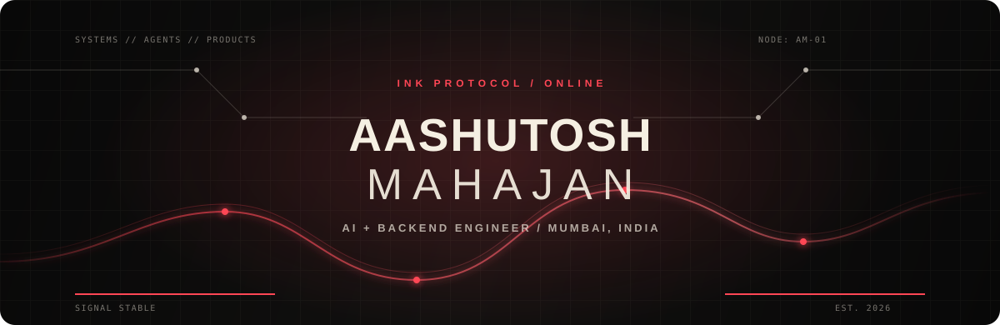
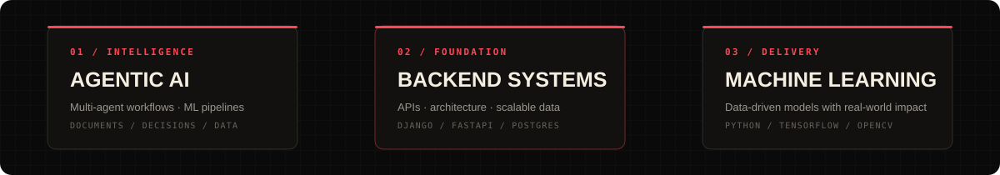
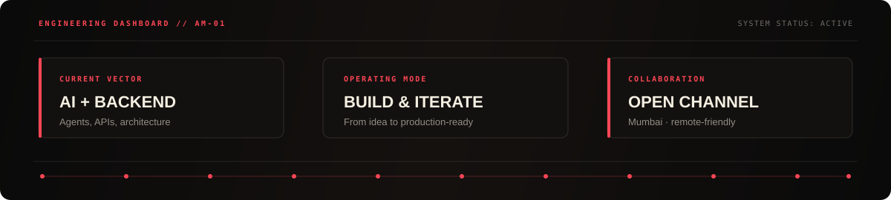

  

   

  
  
  
  

 

## Systems I speak

  

## Engineering telemetry

 

Live · rebuilt from real contribution data every 6 hours by <a href="./.github/workflows/snake.yml">GitHub Actions</a>

## The good stuff

I build intelligent products from the systems layer up: agentic workflows, machine-learning pipelines, dependable APIs, and interfaces that make complex technology feel intuitive. My recent work explores healthcare, financial intelligence, multilingual audio, and developer tooling.

I care about more than getting a demo running. The best projects pair thoughtful architecture with fast iteration, clear product decisions, and an experience people actually want to use.

  <a href="https://aashutoshmahajan.me/"><strong>Explore the full project archive &rarr;</strong></a>
  &nbsp;&middot;&nbsp;
  <a href="mailto:aashutoshmahajan.2007@gmail.com"><strong>Let's build something memorable &rarr;</strong></a>

    
  Made with intent, curiosity, and a little healthy obsession with clean systems.

    
  

