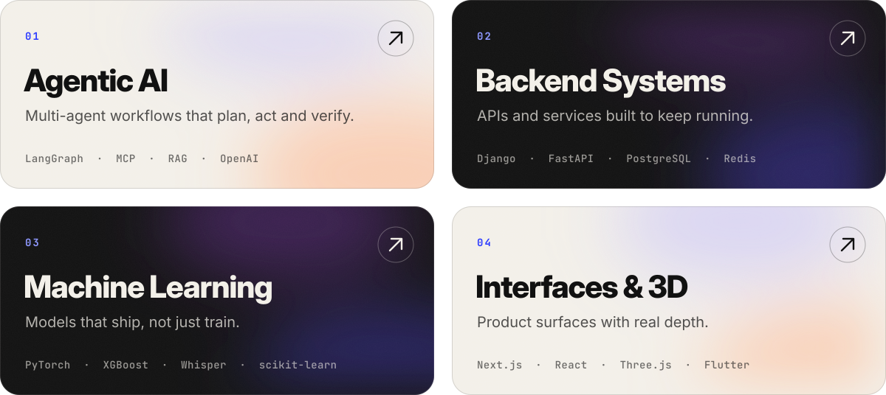

 

## About

## What I work on

## Selected work

- **[PRISM](https://github.com/Aashutosh-Mahajan/prism)**: a persistent, local context layer for AI coding agents.
- **[ArogyaTrack](https://github.com/Aashutosh-Mahajan/ArogyaTrack)**: disease surveillance, digital prescriptions and medication management.
- **[AUDITA](https://github.com/Aashutosh-Mahajan/AUDITA)**: a self-verifying data-cleaning agent where the LLM proposes and code verifies.
- **[Spectra](https://github.com/Aashutosh-Mahajan/Spectra)**: six specialist agents that audit a codebase and write the report.
- **[Weaver](https://github.com/Aashutosh-Mahajan/weaver)**: turns any website into a typed, self-healing MCP server.
- **[Lunar Mission Simulator](https://lunar-mission-simulator.vercel.app/)**: a playable Apollo-style lunar mission, built entirely in the browser.

More on the [portfolio](https://aashutoshmahajan.me/) and in my [repositories](https://github.com/Aashutosh-Mahajan?tab=repositories).

## Stack

## Activity

 

<i>"Perfection is achieved, not when there is nothing more to add, but when there is nothing left to take away."</i> Antoine de Saint-Exupéry

